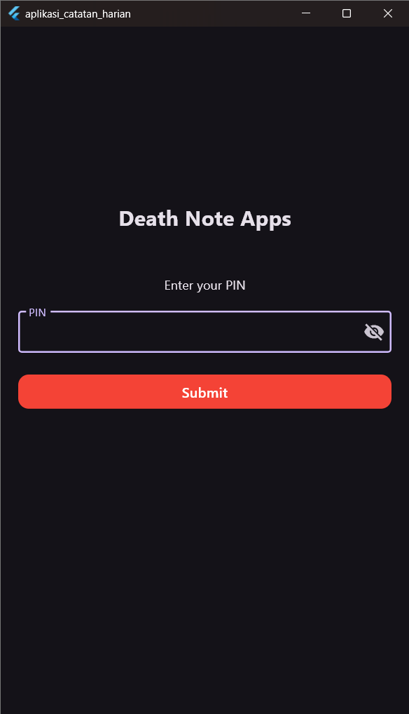
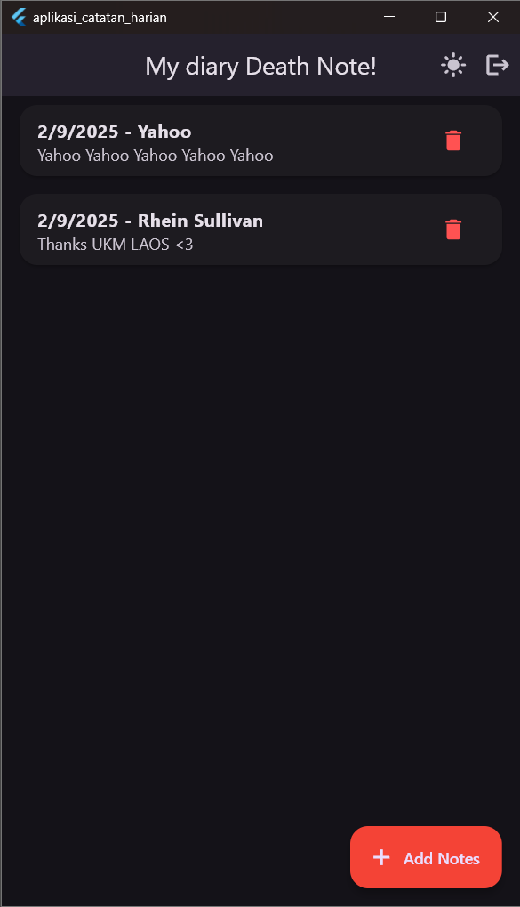
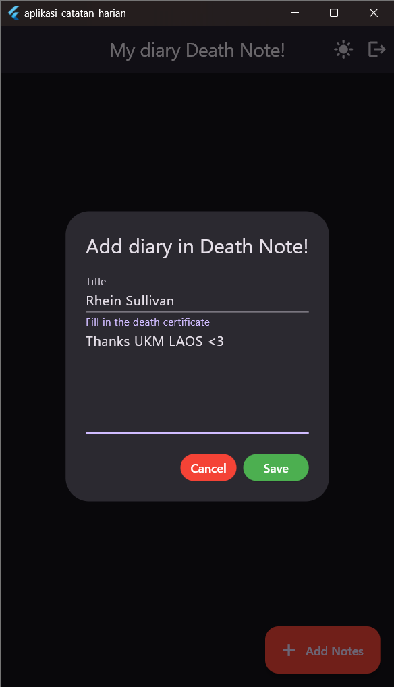
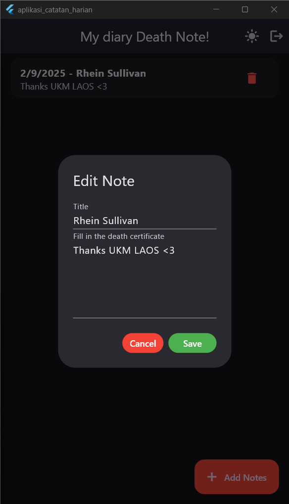
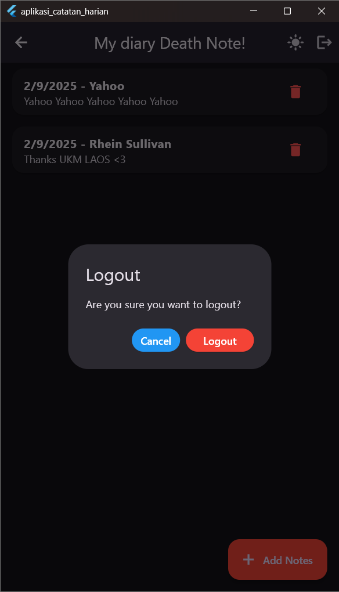

# Death Note Apps 💀📖

A secure personal notes application protected with PIN authentication to keep your notes private.  
Developed by _**Rhein Sullivan**_ as part of _Mobile Development 2025 with UKM LAOS_.

## ✨ Key Features

- **🔐 PIN Authentication**: Protects your notes with a PIN system
- **📝 Note Management**: Create, edit, and delete notes easily
- **💾 Local Storage**: All data is stored securely on the device using SQLite
- **📱 User-Friendly Interface**: Clean and simple UI for easy use
- **🔄 Real-time Updates**: Notes update instantly after changes
- **📅 Timestamp**: Each note has creation and update time

## 🛠️ Tech Stack

- **Framework**: Flutter
- **Language**: Dart
- **Database**: SQLite (via `sqflite`)
- **Storage**: SharedPreferences (for PIN management)
- **Platform**: Android, iOS, Web

### Dependencies

```yaml
dependencies:
  flutter:
    sdk: flutter
  cupertino_icons: ^1.0.8
  sqflite: ^2.4.1
  sqflite_common_ffi: ^2.3.4
  shared_preferences: ^2.5.3
  path: ^1.8.3
```

## 📱 Screenshots

### 1. PIN Login Screen
<p align="center">
  
</p>

### 2. Home Notes Screen
<p align="center">
  
</p>

### 3. Add Note Screen
<p align="center">
  
</p>

### 4. Edit Note Screen
<p align="center">
  
</p>

### 5. Logout PIN Screen
<p align="center">
  
</p>

---

## 🚀 Installation & Run

### Requirements

- Flutter SDK (≥ 3.6.1)
- Android Studio / VS Code
- Android SDK for Android development
- Xcode for iOS development (macOS only)

### Installation Steps

1. **Clone the repository**

   ```bash
   git clone https://github.com/RheinSullivan/death_note_apps-ukm_laos.git
   cd death_note_apps-ukm_laos
   ```

2. **Install dependencies**

   ```bash
   flutter pub get
   ```

3. **Run the app**

   ```bash
   flutter run
   ```

### Build for Release

**Android:**

```bash
flutter build apk --release
```

**iOS:**

```bash
flutter build ios --release
```

**Web:**

```bash
flutter build web
```

---

## 📁 Project Structure

```
lib/
├── main.dart                  # Application entry point
├── data/
│   ├── database_local.dart    # Local SQLite database handler
│   ├── note.dart              # Data model for notes
│   └── pin_service.dart       # PIN storage and authentication service
└── screen/
    ├── home/
    │   └── screen.dart        # Home screen with notes list
    └── pin/
        └── screen.dart        # PIN login screen
```

---

## 🔧 Database Schema

SQLite database with table `notes`:

```sql
CREATE TABLE notes(
  id TEXT PRIMARY KEY,
  title TEXT,
  content TEXT,
  createdAt TEXT,
  updatedAt TEXT
)
```

---

## 🔒 Security

- **PIN Protection**: All notes are locked behind a PIN
- **Local Storage Only**: No server, data stays on your device
- **Session Management**: Login state saved securely
- **Safe Input Handling**: PIN must be numeric

---

## 🎯 How to Use

1. **First launch**: Create a new PIN
2. **Next login**: Enter the saved PIN to unlock
3. **Add a note**: Tap “Add Note” and fill in title + content
4. **Edit a note**: Tap on an existing note
5. **Delete a note**: Tap the delete (🗑️) button
6. **Logout**: Tap the logout button in the AppBar

---

## 🐛 Troubleshooting

### Common Issues

1. **Build error on Android**

   ```bash
   flutter clean
   flutter pub get
   cd android && ./gradlew clean && cd ..
   flutter run
   ```

2. **Database not initialized**

   - Make sure `sqflite_common_ffi` is properly set when testing on desktop
   - Reinstall the app if the issue persists

3. **Forgot PIN**
   - Clear app data from device settings
   - Or reinstall the app

---

## 🤝 Contribution

Contributions are welcome!

1. Fork the repository
2. Create a new branch (`git checkout -b feature-name`)
3. Commit changes (`git commit -m "Add new feature"`)
4. Push to branch (`git push origin feature-name`)
5. Create a Pull Request

---

## 📄 License

This project is developed for educational and learning purposes.

---

## 👨‍💻 Developer

Developed with ❤️ by _**Rhein Sullivan**_  
Training: _Mobile Development 2025 with UKM LAOS_  
Repository: [Death Note Apps](https://github.com/RheinSullivan/death_note_apps-ukm_laos)

---

**Note**: This app is designed for learning Flutter with a focus on local data security and proper state management.

A new Flutter project.

## Getting Started

This project is a starting point for a Flutter application.

A few resources to get you started if this is your first Flutter project:

- [Lab: Write your first Flutter app](https://docs.flutter.dev/get-started/codelab)
- [Cookbook: Useful Flutter samples](https://docs.flutter.dev/cookbook)

For help getting started with Flutter development, view the
[online documentation](https://docs.flutter.dev/), which offers tutorials,
samples, guidance on mobile development, and a full API reference.
